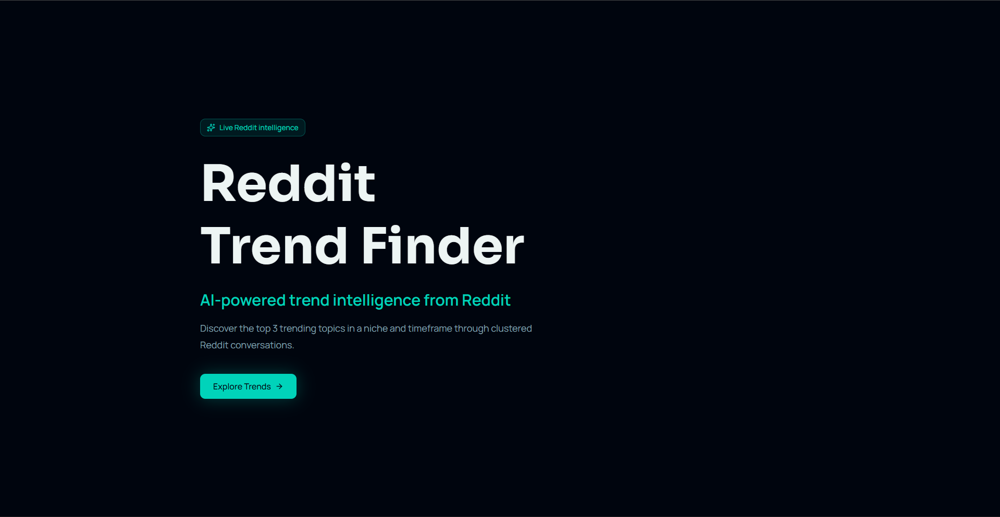

# 🔍 Reddit Trend Finder

<div align="center">

**An end-to-end NLP pipeline that clusters Reddit posts with HDBSCAN, scores clusters by engagement, and generates structured trend reports using Gemini LLM — week by week, niche by niche.**

[](https://www.python.org/)
[](https://fastapi.tiangolo.com)
[](https://github.com/pgvector/pgvector)
[](https://hdbscan.readthedocs.io/)
[](https://ai.google.dev/)
[](https://react.dev/)
[](LICENSE)

**CSE445 Group 04 — Machine Learning Project**
*North South University, Spring 2026*

</div>

---

## 📺 Demo

> Weekly trend analysis across 6 Reddit niches — clustered, scored, and summarised by AI.

<div align="center">
  <a href="https://drive.google.com/file/d/1Cd3Y9Fh1dCGX65noazCXF3Qj5aqtFwJT/view?usp=sharing" target="_blank">
    
  </a>
  <br/>
  <sub>▶ Click to watch the demo video</sub>
</div>

---

## 📌 What is This?

**Reddit Trend Finder** is a production-grade pipeline that turns raw Reddit posts into actionable trend intelligence. The system ingests ~7,090 posts across 6 subreddit niches, generates 384-dimensional sentence embeddings, reduces dimensionality with UMAP, clusters the posts using HDBSCAN, scores clusters by a weighted engagement formula, selects the most representative posts using membership probabilities, and generates structured trend reports via Google's Gemini LLM — all served through a FastAPI backend and a React frontend.

### 🎯 Project Objectives

1. **Clustering Pipeline**: Build a weekly clustering system that automatically discovers trending topics from Reddit posts without pre-specifying the number of clusters
2. **Model Comparison**: Evaluate and compare four clustering algorithms (K-Means, HDBSCAN, GMM, Agglomerative) using internal and external metrics
3. **LLM Integration**: Use HDBSCAN's probability-aware post selection to feed the most representative posts to Gemini for structured trend generation
4. **Full-Stack Delivery**: Serve results through a REST API with a guided React frontend for interactive exploration

### 🏆 Key Features

- ✅ **HDBSCAN Clustering** with automatic cluster discovery and noise detection
- ✅ **UMAP Dimensionality Reduction** (384-d → 20-d) preserving neighborhood structure
- ✅ **Probability-Aware Post Selection** (60% HDBSCAN probability + 40% engagement)
- ✅ **Weighted Cluster Scoring**: `score × 0.5 + comments × 0.3 + upvote_ratio × 100 × 0.2`
- ✅ **Gemini LLM Trend Generation** with structured JSON output (title, entities, sentiment, references)
- ✅ **FastAPI Backend** with week-aware REST endpoints
- ✅ **React Frontend** with a 4-page guided flow (Welcome → Niche → Timeframe → Trends)
- ✅ **PostgreSQL + pgvector** for embedding storage and retrieval
- ✅ **Hyperparameter Optimization** via grid search with composite scoring

---

## 🏗️ Architecture

```
final_trendingtopics_reddit.csv
          │
          ▼
┌───────────────────────────────────────────────────────────────────────┐
│                         DATA PIPELINE                                 │
│                                                                       │
│  ┌───────────────┐    ┌────────────────┐    ┌──────────────────┐     │
│  │ load_reddit   │───▶│  generate      │───▶│    main.py       │     │
│  │ _data.py      │    │ _embeddings.py │    │   (pipeline)     │     │
│  │               │    │                │    │                  │     │
│  │ CSV → DB      │    │ text →         │    │ UMAP → HDBSCAN  │     │
│  │ (7,090 posts) │    │ 384-d vectors  │    │ → Score → Top 3 │     │
│  └───────────────┘    └────────────────┘    │ → Gemini → JSON  │     │
│                                             └────────┬─────────┘     │
│                                                      │                │
│                                                      ▼                │
│                                      support/output/weekly_trends.json│
└───────────────────────────────────────────────────────────────────────┘
          │
          ▼
┌───────────────────────────────────────────────────────────────────────┐
│  FastAPI Backend (support/backend/main.py)                            │
│                                                                       │
│  GET  /api/v1/niches                → niche summaries                 │
│  GET  /api/v1/trends/{niche}        → all weeks for a niche           │
│  GET  /api/v1/trends/{niche}?week=N → single week                     │
│  GET  /api/v1/weekly-summary        → lightweight week breakdown      │
│  POST /api/v1/reload                → reload trends from disk         │
└───────────────────────────────────────────────────────────────────────┘
          │
          ▼
┌───────────────────────────────────────────────────────────────────────┐
│  React Frontend (support/frontend/)                                   │
│                                                                       │
│  Welcome → Niche Selection → Timeframe Selection → Trend Results      │
│  (4-page guided flow with loading skeletons and dark theme)           │
└───────────────────────────────────────────────────────────────────────┘
```

---

## 🔬 Model Comparison

We experimented with four clustering algorithms — **K-Means**, **HDBSCAN**, **GMM (Gaussian Mixture Model)**, and **Agglomerative Clustering** — and evaluated them using internal metrics on a weekly slice (r/technology, Week 14, 223 posts):

| Algorithm | Clusters | Noise Points | Silhouette ↑ | Calinski-Harabasz ↑ | Davies-Bouldin ↓ | Time (s) | Requires *k*? |
|---|---|---|---|---|---|---|---|
| K-Means | 12 | 0 | 0.4309 | **151.62** | 0.8406 | 2.20 | Yes |
| **HDBSCAN** | **7** | **30** | **0.4851** | 137.00 | 0.8029 | **0.01** | **No** |
| GMM | 12 | 0 | 0.4503 | 148.64 | 0.8217 | 0.07 | Yes |
| Agglomerative | 12 | 0 | 0.4091 | 139.90 | **0.7876** | 0.03 | Yes |

### Key Findings

- **HDBSCAN achieved the highest Silhouette score (0.4851)** by excluding noise points instead of forcing every post into a cluster. The 30 noise posts are irrelevant or off-topic content that would drag down cluster quality if assigned.
- **HDBSCAN requires no pre-specified *k***, automatically discovering 7 clusters from 223 posts — a significant practical advantage when the number of weekly topics is unknown.
- **HDBSCAN was the fastest** at 0.01s, compared to K-Means at 2.20s.
- **Agglomerative had the lowest Davies-Bouldin (0.7876)** but the worst Silhouette, suggesting compact clusters that aren't well-separated from each other.
- **HDBSCAN's membership probabilities** enable probability-aware post selection (60% probability + 40% engagement), ensuring the LLM receives posts that are central to each cluster's topic — not just viral outliers.

**HDBSCAN was selected as the production algorithm** for its combination of automatic cluster discovery, noise handling, fast runtime, and probability outputs.

---

## 📊 Sample Output

The pipeline generates structured trend reports per niche per week. Example from **r/technology, Week 13 (Mar 25 – Mar 29, 2026)**:

> **#1 — Reddit's Bot Crackdown: Verifying Human Identity Online** (Mixed)
>
> Reddit is implementing stricter measures to verify human users and combat bot activity, driven by concerns over platform integrity and the proliferation of AI-generated content. Users are discussing the necessity of these measures due to the increasing prevalence of 'fishy' accounts, signaling a broader industry-wide effort to distinguish between authentic and automated online interactions.
>
> 🏢 Reddit, FBI · 📦 FaceID · 📎 3 references

> **#2 — AI's Impact on Human Roles and AI Ethics Debate** (Mixed)
>
> The community is actively debating the evolving role of AI, particularly its implications for human creativity and employment, with discussions ranging from job displacement to the ethical considerations of AI-generated content.
>
> 🏢 Palantir, Meta, Deloitte, Anthropic, BlackRock · 📦 AI · 📎 3 references

> **#3 — Tech Giants Face Liability Over Harm to Young Users** (Negative)
>
> There's a significant recurring discussion around major tech companies facing legal challenges and liability related to the impact of their platforms on young users.
>
> 🏢 Meta, Google, YouTube · 📎 3 references

Each trend includes: title, description, key entities (companies/products/people), sentiment, importance statement, and Reddit permalink references.

---

## 📁 Project Structure

```
Trend-Finder/
├── main.py                             # 🚀 Pipeline entry point (console runner)
├── data/
│   └── final_trendingtopics_reddit.csv # Preprocessed Reddit dataset (~7,090 posts)
├── support/
│   ├── backend/
│   │   ├── __init__.py
│   │   ├── main.py                     # FastAPI app with week-aware endpoints
│   │   ├── models.py                   # Pydantic v2 schemas
│   │   └── database.py                # Data access layer (loads JSON)
│   ├── clustering/
│   │   ├── __init__.py
│   │   ├── weekly_hdbscan.py          # UMAP + HDBSCAN + scoring + post selection
│   │   └── gemini_trends.py           # Prompt builder + Gemini API + NER
│   ├── preprocessing/
│   │   ├── __init__.py
│   │   └── text_cleaner.py            # Text cleaning utilities
│   ├── frontend/                       # React frontend (see below)
│   ├── output/
│   │   └── weekly_trends.json         # Generated trend results
│   ├── __init__.py
│   ├── config.py                       # Central configuration
│   ├── database_util.py               # PostgreSQL + pgvector helpers
│   ├── setup_database.py              # One-time DB setup
│   ├── load_reddit_data.py            # CSV → PostgreSQL
│   ├── generate_embeddings.py         # Text → 384-d vectors
│   ├── test_connection.py             # DB connectivity test
│   ├── compare_clustering.py          # Weekly model comparison (4 algorithms)
│   ├── compare_clustering_full.py     # Full-dataset model comparison
│   ├── gridsearch_hdbscan.py          # Hyperparameter optimization
│   ├── docker-compose.yml             # PostgreSQL + pgvector container
│   └── .env.example                   # Environment variable template
├── others/
│   ├── assets/                         # Frontend screenshots, demo video
│   ├── figures/                        # Experimental plots and charts
│   ├── presentation/                   # Project presentation slides
│   └── report/                         # LaTeX report
├── requirements.txt
├── .gitignore
├── LICENSE
└── README.md
```

### Frontend Structure (`support/frontend/`)

```
frontend/
├── src/
│   ├── components/                     # Reusable UI components
│   ├── hooks/                          # Custom React hooks
│   ├── lib/                            # API helpers and utilities
│   ├── routes/                         # App pages and routes
│   ├── route.tsx                       # Route setup file
│   ├── routeTree.gen.ts               # Auto-generated route tree
│   └── styles.css                      # Global Tailwind CSS styles
├── .env                                # VITE_API_BASE_URL
├── components.json                     # UI component config
├── eslint.config.js
├── package.json
├── tsconfig.json
├── vite.config.ts
└── README.md                           # Frontend setup instructions
```

---

## ⚙️ Tech Stack

| Layer | Technology |
|---|---|
| Database | PostgreSQL 16 + pgvector |
| Embeddings | Sentence-Transformers (`all-MiniLM-L6-v2`, 384-d) |
| Dimensionality Reduction | UMAP (20-d target, cosine metric) |
| Clustering | HDBSCAN (`min_cluster_size=15`, `min_samples=5`, EOM) |
| Trend Generation | Google Gemini 2.5 Flash Lite |
| Named Entity Recognition | spaCy (`en_core_web_sm`) |
| Backend API | FastAPI + Uvicorn + Pydantic v2 |
| Frontend | React + Tailwind CSS + Vite |
| Containerisation | Docker Compose |

---

## 🛠️ Local Setup

### Prerequisites

- Python 3.11+
- Node.js 18+ and Bun (for frontend)
- Docker Desktop (for PostgreSQL)
- [Gemini API key](https://ai.google.dev/) (free tier available)

### 1. Clone the repository

```bash
git clone https://github.com/t4niha/Trend-Finder.git
cd Trend-Finder
```

### 2. Install Python dependencies

```bash
pip install -r requirements.txt
python -m spacy download en_core_web_sm
```

### 3. Start PostgreSQL

```bash
cd support
docker-compose up -d
```

### 4. Configure environment

```bash
cp .env.example .env
# Edit .env → add your GEMINI_API_KEY
```

### 5. Set up database & load data

```bash
cd support
python test_connection.py          # verify DB is reachable
python setup_database.py           # create tables
python load_reddit_data.py         # CSV → posts table
python generate_embeddings.py      # generate 384-d embeddings
```

### 6. Run the clustering pipeline

```bash
# From project root
python main.py --niche technology --week 14    # test single slice
python main.py                                  # all niches, all weeks
```

Output saved to `support/output/weekly_trends.json`.

### 7. Start the API

```bash
cd support
python -m backend.main
```

API live at `http://localhost:8000` — Swagger docs at `http://localhost:8000/docs`.

### 8. Start the frontend

```bash
cd support/frontend
bun install          # or npm install
bun dev              # or npm run dev
```

Frontend live at `http://localhost:5173`.

---

## 📡 API Reference

| Method | Endpoint | Description |
|--------|----------|-------------|
| `GET` | `/api/v1/niches` | List all niches with summary statistics |
| `GET` | `/api/v1/trends/{niche}` | Trends for a niche (all weeks) |
| `GET` | `/api/v1/trends/{niche}?week=14` | Trends for a specific week |
| `GET` | `/api/v1/weekly-summary?niche=technology` | Lightweight week-by-week overview |
| `POST` | `/api/v1/reload` | Reload trends from disk without restart |
| `GET` | `/health` | System health check |

---

## 🔑 Environment Variables

| Variable | Required | Default | Description |
|---|---|---|---|
| `GEMINI_API_KEY` | ✅ | — | Google Gemini API key |
| `GEMINI_MODEL` | | `gemini-2.5-flash-lite` | Gemini model name |
| `DB_USER` | | `postgres` | PostgreSQL user |
| `DB_PASSWORD` | | `postgres` | PostgreSQL password |
| `DB_HOST` | | `localhost` | PostgreSQL host |
| `DB_PORT` | | `5442` | PostgreSQL port |
| `DB_NAME` | | `reddit_trends` | Database name |
| `API_HOST` | | `0.0.0.0` | FastAPI bind address |
| `API_PORT` | | `8000` | FastAPI port |

---

## 🧪 Running Experiments

### Clustering Comparison (weekly)

```bash
cd support
python compare_clustering.py
```

Runs K-Means, HDBSCAN, GMM, and Agglomerative on a single niche/week and outputs a comparison table with Silhouette, Calinski-Harabasz, and Davies-Bouldin scores.

### Clustering Comparison (full dataset)

```bash
cd support
python compare_clustering_full.py
```

Runs all 4 algorithms on the full ~7,090 post dataset with K=6 (matching 6 niches). Includes external metrics (ARI, NMI) against true niche labels.

### HDBSCAN Hyperparameter Grid Search

```bash
cd support
python gridsearch_hdbscan.py --mode full
python gridsearch_hdbscan.py --mode weekly --niche technology --week 14
```

Sweeps 350 combinations of UMAP dimensions, min_cluster_size, min_samples, and cluster selection method. Outputs ranked results with a composite score and config.py suggestions.

---

## 👥 Team Members — Group 04

| Member | Role |
|---|---|
| **Fahim Shahriar** | Team Lead, Core Logic Development, Backend, Testing |
| **Taniha Shiaree Tripura** | Database, Model Experiments, Preprocessing, Testing |
| **Saadia Rahman Oyshi** | Model Experiments, Data Scraping, Testing |
| **Syeda Suhaini Aznum** | Model Experiments, Preprocessing, Data Scraping, Testing |

---

## 📄 License

This project is licensed under the MIT License — see the [LICENSE](LICENSE) file for details.

---

<div align="center">

**Built with ❤️ using HDBSCAN · Gemini · FastAPI · pgvector · Sentence-Transformers · React**

*CSE445 Machine Learning · North South University · Spring 2026*

</div>